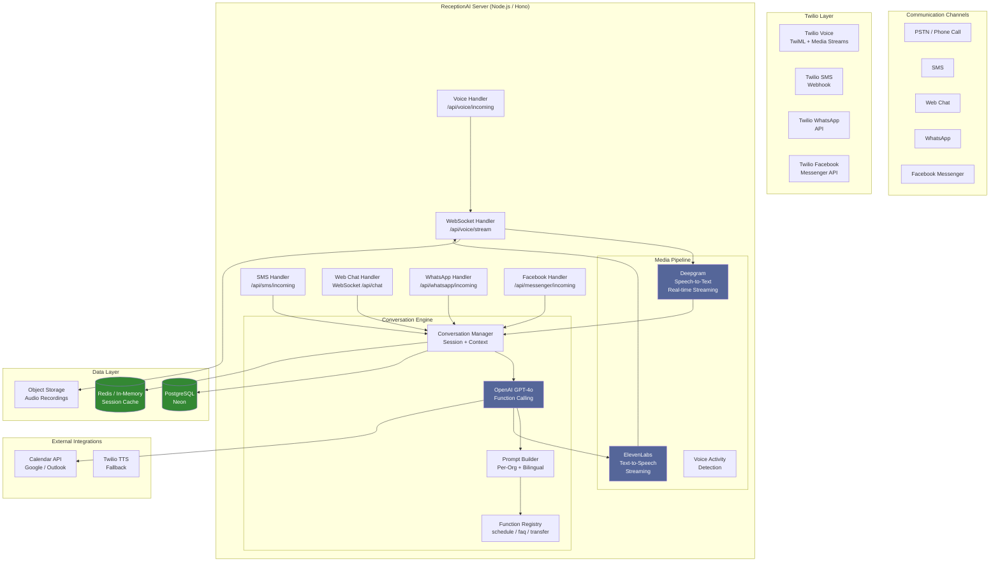

# ReceptionAI — Voice AI Pipeline Architecture

> **Author:** AI/Voice Engineer  
> **Date:** 2026-07-15  
> **Status:** Architecture Plan (v1)

---

## Table of Contents

1. [System Overview](#1-system-overview)
2. [Architecture Diagram](#2-architecture-diagram)
3. [Inbound Call Flow](#3-inbound-call-flow)
4. [Conversation Engine](#4-conversation-engine)
5. [SMS Pipeline](#5-sms-pipeline)
6. [Web Chat Pipeline](#6-web-chat-pipeline)
7. [WhatsApp / Facebook Messenger](#7-whatsapp--facebook-messenger)
8. [Appointment Scheduling Logic](#8-appointment-scheduling-logic)
9. [Human Escalation](#9-human-escalation)
10. [Conversation Recording & Analytics](#10-conversation-recording--analytics)
11. [Multi-Tenant Architecture](#11-multi-tenant-architecture)
12. [Required Services & API Keys](#12-required-services--api-keys)
13. [Directory Structure](#13-directory-structure)
14. [Implementation Roadmap](#14-implementation-roadmap)

---

## 1. System Overview

ReceptionAI is a multi-tenant AI-powered virtual receptionist platform. It receives inbound communications across **voice calls (PSTN), SMS, web chat, WhatsApp, and Facebook Messenger** and responds using an LLM-based conversation engine. The system:

- **Answers 24/7** in English and Spanish
- **Captures caller info** (name, phone, email, service needed)
- **Books, reschedules, or cancels appointments** via calendar integration
- **Answers FAQs** from a business-specific knowledge base
- **Transfers to a human** when the AI determines escalation is needed
- **Sends follow-ups** (confirmations, reminders, thank-you messages)
- **Records conversations** (transcripts + optional audio) for analytics

### Key Design Principles

- **Real-time first**: Voice calls use streaming bidirectional audio (WebSocket via Twilio Media Streams). The system transcribes, thinks, and speaks within ~500ms total latency.
- **Stateless API handlers**: Twilio webhooks hit idempotent handlers that use conversation IDs for context persistence.
- **Multi-tenant isolation**: Every business is an organization. Prompts, knowledge bases, calendar configs, and phone numbers are scoped per-organization.
- **Graceful degradation**: If TTS fails → fallback to Twilio's built-in TTS. If LLM fails → apologise and transfer to human. If STT fails → prompt caller to speak again.

---

## 2. Architecture Diagram



### ASCII Art Diagram (Fallback)

```
┌──────────────┐   ┌─────────┐   ┌──────────┐   ┌─────────┐
│   Phone Call │──▶│ Twilio  │──▶│ Deepgram │──▶│ OpenAI  │
│   SMS        │──▶│ Voice/  │   │ (STT)    │   │ GPT-4o  │
│   Web Chat   │──▶│ SMS/    │   └──────────┘   │ (LLM)   │
│   WhatsApp   │──▶│ WhatsApp│        │          └────┬────┘
│   Facebook   │──▶│ FB Msgr │        │               │
└──────────────┘   └─────────┘        │          ┌────▼────┐
                                       │          │ElevenLabs│
                                       │          │ (TTS)   │
                                       │          └────┬────┘
                                       │               │
                                  ┌────▼───────────────▼────┐
                                  │   Conversation Engine   │
                                  │   - Session Context     │
                                  │   - Prompt Builder      │
                                  │   - Function Calling    │
                                  │   - Bilingual Switch    │
                                  └────┬───────────────┬────┘
                                       │               │
                               ┌───────▼───┐   ┌───────▼───┐
                               │ PostgreSQL │   │   Redis   │
                               │ (Neon)     │   │ (Session) │
                               └───────────┘   └───────────┘
```

---

## 3. Inbound Call Flow

### 3.1 Flow Sequence

```
Caller dials Twilio number
        │
        ▼
Twilio routes call to configured Voice URL
        │
        ▼
POST /api/voice/incoming  ← Twilio webhook (TwiML)
        │
        ├── Returns <Connect> with <Stream> for Media Streams
        │   └── <Say> with greeting (played while AI warms up)
        │
        ▼
WebSocket connection established ← /api/voice/stream?call_sid=xxx&org_id=yyy
        │
        ▼
┌─────────────────────────────────────────────────────────────────┐
│                   Real-time Audio Loop                          │
│                                                                 │
│  Twilio ──(mulaw audio)──▶  Deepgram STT (streaming)           │
│                                     │                           │
│                                     ▼                           │
│                              Partial transcripts (interim)      │
│                              Final transcript (utterance_end)   │
│                                     │                           │
│                                     ▼                           │
│                           Conversation Engine                   │
│                              │                                  │
│                              ▼                                  │
│                           LLM Response                         │
│                              │                                  │
│                              ▼                                  │
│                      ElevenLabs TTS (streaming)                 │
│                              │                                  │
│                              ▼                                  │
│                    Twilio Media Streams ──▶ Caller hears         │
└─────────────────────────────────────────────────────────────────┘
        │
        ▼
Call ends → POST /api/voice/completed  ← Twilio status callback
        │
        ├── Save transcript to DB
        ├── Save audio recording to S3 (if configured)
        ├── Update call analytics
        └── Trigger follow-up actions (if any)
```

### 3.2 TwiML Response (Initial Webhook)

The `/api/voice/incoming` endpoint returns TwiML that:
1. Greets the caller with a short TTS message (using Twilio's built-in TTS so it's instant)
2. Opens a bidirectional Media Stream WebSocket for real-time audio

```xml
<?xml version="1.0" encoding="UTF-8"?>
<Response>
  <Say voice="Polly.Joanna" language="en-US">
    Thank you for calling. Please hold while I connect you.
  </Say>
  <Connect>
    <Stream url="wss://receptionai.app/api/voice/stream">
      <Parameter name="callSid" value="CAxxxx"/>
      <Parameter name="organizationId" value="org_xxx"/>
      <Parameter name="language" value="en"/><!-- or es -->
    </Stream>
  </Connect>
</Response>
```

### 3.3 WebSocket Message Protocol

Each message over the Media Stream is JSON:

**From Twilio → Server:**
```json
{
  "event": "media",
  "streamSid": "MZ_xxx",
  "media": {
    "track": "inbound",
    "chunk": "base64-encoded-mulaw",
    "timestamp": 12345
  }
}
```

**From Server → Twilio:**
```json
{
  "event": "media",
  "streamSid": "MZ_xxx",
  "media": {
    "track": "outbound",
    "chunk": "base64-encoded-mulaw",
    "timestamp": 12345
  }
}
```

### 3.4 Key Implementation Details

| Component | Technology | Details |
|-----------|-----------|---------|
| WebSocket Server | `ws` or `@fastify/websocket` on Hono/Fastify | Hosted behind the same origin as the site |
| Audio Codec | μ-law 8000 Hz, 8-bit | Twilio's standard — must match |
| Deepgram STT | `@deepgram/sdk` with LiveTranscription | Streaming, interim results, language detection |
| VAD | Deepgram's built-in VAD or Silero VAD | Detect when caller finishes speaking to trigger response |
| OpenAI | `openai` SDK with streaming | model: `gpt-4o` or `gpt-4o-mini`, tool calling enabled |
| TTS | ElevenLabs streaming TTS | `elevenlabs` npm package, stream to Twilio |
| Fallback TTS | Twilio `<Say>` with Polly | If ElevenLabs fails |

### 3.5 Latency Budget

| Step | Target Latency |
|------|---------------|
| STT (end of speech to transcript) | <300ms |
| LLM (first token) | <200ms |
| TTS (first audio chunk) | <200ms |
| **Total (end of caller speech → start of AI speech)** | **<700ms** |
| Ongoing streaming latency | <200ms per chunk |

---

## 4. Conversation Engine

### 4.1 Core Architecture

The Conversation Engine is the central AI logic that processes all inbound messages regardless of channel.

```
                    ┌─────────────────────────┐
                    │   Conversation Engine    │
                    │                          │
┌──────────┐       │  ┌───────────────────┐   │
│  STT /   │──────▶│  │  Session Manager   │   │
│  Text    │       │  │  - Conversation ID │   │
│  Input   │       │  │  - Message History  │   │
└──────────┘       │  │  - Org Context      │   │
                    │  └────────┬──────────┘   │
                    │           │               │
                    │  ┌────────▼──────────┐   │
                    │  │  Prompt Builder    │   │
                    │  │  - System Prompt   │   │
                    │  │  - Org KB          │   │
                    │  │  - Language        │   │
                    │  │  - Call Context    │   │
                    │  └────────┬──────────┘   │
                    │           │               │
                    │  ┌────────▼──────────┐   │
                    │  │  OpenAI GPT-4o     │   │
                    │  │  - Chat Completion │   │
                    │  │  - Tool/Function   │   │
                    │  │    Calling         │   │
                    │  └────────┬──────────┘   │
                    │           │               │
                    │  ┌────────▼──────────┐   │
                    │  │  Response Router   │   │
                    │  │  - TTS (voice)     │   │
                    │  │  - Text (SMS/chat) │   │
                    │  │  - Escalation      │   │
                    │  └───────────────────┘   │
                    └─────────────────────────┘
```

### 4.2 System Prompt (Receptionist AI Persona)

The system prompt is constructed dynamically per organization and per conversation:

```typescript
interface SystemPromptInput {
  organization: {
    name: string;
    industry: string;
    businessHours: string;
    timezone: string;
    locale: string;
    services: Service[];
    faqEntries: FAQEntry[];
    escalationPhone: string;
    calendarConfig: CalendarConfig;
  };
  conversation: {
    language: 'en' | 'es' | 'mixed';
    channel: 'voice' | 'sms' | 'chat' | 'whatsapp' | 'messenger';
    callerName?: string;
    callerPhone?: string;
    callerEmail?: string;
  };
}
```

**Core System Prompt Template (en):**

```
You are an AI receptionist for {organization.name}, a {organization.industry} business.
Your name is "ReceptionAI" for this business.

## YOUR ROLE
- Answer inbound calls, texts, and messages professionally and warmly.
- Your goal is to help the customer and book appointments when appropriate.
- Be concise and natural in conversation. On voice calls, keep responses brief (under 30 seconds).
- If the customer speaks Spanish, respond in Spanish. Detect language automatically.

## BUSINESS DETAILS
- Business Name: {organization.name}
- Industry: {organization.industry}
- Hours: {organization.businessHours}
- Timezone: {organization.timezone}

## SERVICES OFFERED
{organization.services.map(s => `- ${s.name}: ${s.description}`).join('\n')}

## FREQUENTLY ASKED QUESTIONS
{organization.faqEntries.map(f => `Q: ${f.question}\nA: ${f.answer}`).join('\n')}

## APPOINTMENT RULES
- Ask for the customer's name, phone number, and what service they need.
- Check availability before offering times.
- Offer 2-3 time options if possible.
- Confirm the booking details before finalizing.
- For cancellations: confirm the appointment details and cancel.
- For rescheduling: cancel the old appointment first, then book new one.

## ESCALATION RULES
If any of these occur, offer to transfer to a human:
- Customer is angry or upset
- Customer asks for a manager or human
- Customer has a complex issue you cannot resolve
- Customer insists on speaking to a person
- Safety or emergency-related conversations
- Three failed attempts to understand the customer

## CONVERSATION GUIDELINES
- On voice calls: keep responses short (2-3 sentences typically)
- On text/SMS: be concise, use bullet points sparingly
- Never make promises about pricing or availability you cannot verify
- Always confirm before booking
- If you don't know an answer, say "Let me transfer you to a team member who can help"
- End every interaction with: "Is there anything else I can help you with?"
```

### 4.3 Function Calling Tools

The LLM uses OpenAI function calling to perform actions. Here is the complete tool registry:

#### 4.3.1 `capture_customer_info`

```json
{
  "name": "capture_customer_info",
  "description": "Save customer information gathered during the conversation",
  "parameters": {
    "type": "object",
    "properties": {
      "name": { "type": "string", "description": "Customer's full name" },
      "phone": { "type": "string", "description": "Customer's phone number" },
      "email": { "type": "string", "description": "Customer's email address" },
      "notes": { "type": "string", "description": "Any additional notes about the customer or their request" }
    },
    "required": ["name"]
  }
}
```

#### 4.3.2 `check_availability`

```json
{
  "name": "check_availability",
  "description": "Check available appointment slots for a service on a given date",
  "parameters": {
    "type": "object",
    "properties": {
      "service": { "type": "string", "description": "The requested service name" },
      "date": { "type": "string", "description": "Date to check (YYYY-MM-DD format)" },
      "duration_minutes": { "type": "integer", "description": "Appointment duration in minutes" }
    },
    "required": ["service", "date"]
  }
}
```

#### 4.3.3 `book_appointment`

```json
{
  "name": "book_appointment",
  "description": "Book an appointment for a customer",
  "parameters": {
    "type": "object",
    "properties": {
      "customer_name": { "type": "string", "description": "Customer's full name" },
      "customer_phone": { "type": "string", "description": "Customer's phone number" },
      "customer_email": { "type": "string", "description": "Customer's email" },
      "service": { "type": "string", "description": "Service name" },
      "date": { "type": "string", "description": "Appointment date (YYYY-MM-DD)" },
      "time": { "type": "string", "description": "Appointment time (HH:MM)" },
      "notes": { "type": "string", "description": "Any special notes or instructions" }
    },
    "required": ["customer_name", "customer_phone", "service", "date", "time"]
  }
}
```

#### 4.3.4 `cancel_appointment`

```json
{
  "name": "cancel_appointment",
  "description": "Cancel an existing appointment",
  "parameters": {
    "type": "object",
    "properties": {
      "appointment_id": { "type": "string", "description": "ID of the appointment to cancel" },
      "customer_phone": { "type": "string", "description": "Customer's phone number for verification" },
      "reason": { "type": "string", "description": "Reason for cancellation" }
    },
    "required": ["appointment_id"]
  }
}
```

#### 4.3.5 `reschedule_appointment`

```json
{
  "name": "reschedule_appointment",
  "description": "Reschedule an existing appointment to a new time",
  "parameters": {
    "type": "object",
    "properties": {
      "appointment_id": { "type": "string", "description": "ID of the appointment to reschedule" },
      "new_date": { "type": "string", "description": "New date (YYYY-MM-DD)" },
      "new_time": { "type": "string", "description": "New time (HH:MM)" },
      "reason": { "type": "string", "description": "Reason for rescheduling" }
    },
    "required": ["appointment_id", "new_date", "new_time"]
  }
}
```

#### 4.3.6 `lookup_customer`

```json
{
  "name": "lookup_customer",
  "description": "Look up a customer by phone number or email to find their existing appointments",
  "parameters": {
    "type": "object",
    "properties": {
      "phone": { "type": "string", "description": "Customer's phone number" },
      "email": { "type": "string", "description": "Customer's email address" }
    },
    "required": []
  }
}
```

#### 4.3.7 `transfer_to_human`

```json
{
  "name": "transfer_to_human",
  "description": "Transfer the customer to a human team member",
  "parameters": {
    "type": "object",
    "properties": {
      "reason": { "type": "string", "description": "Reason for the transfer" },
      "urgency": { "type": "string", "enum": ["low", "medium", "high"], "description": "Urgency of the transfer" },
      "summary": { "type": "string", "description": "Brief summary of the conversation so far for the human" }
    },
    "required": ["reason", "summary"]
  }
}
```

#### 4.3.8 `answer_faq`

```json
{
  "name": "answer_faq",
  "description": "Look up an answer from the business FAQ/knowledge base",
  "parameters": {
    "type": "object",
    "properties": {
      "query": { "type": "string", "description": "The customer's question to search in the knowledge base" }
    },
    "required": ["query"]
  }
}
```

#### 4.3.9 `send_confirmation`

```json
{
  "name": "send_confirmation",
  "description": "Send an appointment confirmation message to the customer via their preferred channel",
  "parameters": {
    "type": "object",
    "properties": {
      "appointment_id": { "type": "string", "description": "ID of the confirmed appointment" },
      "channel": { "type": "string", "enum": ["sms", "email"], "description": "Channel to send confirmation via" }
    },
    "required": ["appointment_id", "channel"]
  }
}
```

#### 4.3.10 `set_language_preference`

```json
{
  "name": "set_language_preference",
  "description": "Set or change the language preference for this conversation",
  "parameters": {
    "type": "object",
    "properties": {
      "language": { "type": "string", "enum": ["en", "es"], "description": "Language code" }
    },
    "required": ["language"]
  }
}
```

### 4.4 Context Management

Conversation context is managed at multiple levels:

| Level | Storage | Lifetime | Contents |
|-------|---------|----------|----------|
| **Message History** | In-memory (per session) + DB (persisted) | Duration of conversation + 30 days in DB | Array of `{role, content, timestamp}` messages |
| **Session State** | Redis (TTL: 24h) | Duration of conversation | `{language, customerInfo, pendingAction, lastToolCall}` |
| **Org Config** | PostgreSQL (loaded at start) | Per conversation | Business hours, services, FAQ, escalation rules |
| **Long-term Store** | PostgreSQL | Indefinite | Customer records, appointment history |

**Message Truncation Strategy:**
- Keep the system prompt + last 20 messages + any relevant function results
- Summarize older messages when context exceeds token budget (~8K tokens for voice, ~16K for text)
- Use token counting via `tiktoken` to manage the window

### 4.5 Bilingual Detection & Switching

```
Caller speaks
     │
     ▼
Deepgram STT with language detection
     │
     ├── Detected: "en" → English system prompt, English TTS
     │
     ├── Detected: "es" → Spanish system prompt, Spanish TTS
     │
     └── Mixed → LLM detects language switch
                     │
                     ▼
              set_language_preference() called
                     │
                     ▼
              Switch system prompt language
              Switch TTS voice (if separate voice per language)
```

**Implementation details:**
- Deepgram can do real-time language detection (set `language: "multi"` or `language: "en|es"`)
- The system prompt contains bilingual instructions so the LLM naturally switches
- Spanish voice variant is used for TTS when Spanish is detected
- The `set_language_preference` tool allows explicit switching

---

## 5. SMS Pipeline

### 5.1 Flow

```
Customer sends SMS → Twilio number
        │
        ▼
POST /api/sms/incoming  ← Twilio SMS webhook
        │
        ├── Parse: from number, body text, media URLs
        ├── Load org context (from Twilio number → org mapping)
        ├── Load conversation history (by caller phone + org)
        │
        ▼
Conversation Engine ← process message
        │
        ├── LLM generates response (text-only, no TTS)
        ├── Function calls (same tools as voice)
        │
        ▼
POST response back to Twilio Messaging API
        │
        ▼
Customer receives SMS reply
```

### 5.2 Key Implementation Details

| Aspect | Detail |
|--------|--------|
| **Webhook URL** | `POST /api/sms/incoming` — Twilio's Messaging webhook |
| **Rate Limiting** | Max 1 SMS/sec per conversation (Twilio limit) |
| **Character Limit** | LLM responses capped at 1600 chars; split into segments if needed |
| **Media Handling** | Support receiving MMS (images); store media URLs, describe to LLM |
| **Conversation Threading** | Grouped by caller phone + org ID; 7-day expiry |
| **Sending** | Use Twilio's `messages.create()` REST API |

### 5.3 TwiML Response (for inbound SMS)

```xml
<?xml version="1.0" encoding="UTF-8"?>
<Response>
  <Message>
    Thanks for your message! Our AI receptionist will respond shortly.
  </Message>
</Response>
```

For async flow, the webhook returns `200 OK` immediately and sends the AI response via the REST API.

---

## 6. Web Chat Pipeline

### 6.1 Flow

```
Customer opens web chat widget
        │
        ▼
WebSocket connection to /api/chat/connect
        │
        ├── Sends org_id, optional customer info
        ├── Session established
        │
        ▼
┌─────────────────────────────────────────────────┐
│               Chat Loop                          │
│                                                  │
│  Customer sends text ──▶ WebSocket message      │
│                               │                 │
│                               ▼                 │
│                    Conversation Engine           │
│                               │                 │
│                               ▼                 │
│                    AI text response              │
│                               │                 │
│                               ▼                 │
│                    WebSocket message ──▶ Client  │
└─────────────────────────────────────────────────┘
```

### 6.2 WebSocket Protocol

**Client → Server:**
```json
{
  "type": "message",
  "content": "I need to book an appointment for AC repair",
  "session_id": "sess_xxx",
  "org_id": "org_xxx",
  "customer": { "name": "John", "email": "john@example.com" }
}
```

**Server → Client:**
```json
{
  "type": "message",
  "content": "I'd be happy to help you book an AC repair appointment! Could you please tell me your full name and preferred date?",
  "session_id": "sess_xxx",
  "timestamp": "2026-07-15T12:00:00Z"
}
```

**Server → Client (typing indicator):**
```json
{
  "type": "typing",
  "session_id": "sess_xxx",
  "status": "ai_thinking"
}
```

**Server → Client (function result):**
```json
{
  "type": "action",
  "session_id": "sess_xxx",
  "action": "booking_confirmed",
  "data": { "appointment_id": "apt_xxx", "date": "2026-07-20", "time": "10:00" }
}
```

### 6.3 Implementation

- WebSocket server runs on the same origin as the main site (port 3000)
- Use `ws` npm package or framework-native WebSocket support (e.g., Hono's `upgradeWebSocket`)
- Reconnection handling with `session_id` to restore context
- Embed widget as a small React component that loads on the business's website

---

## 7. WhatsApp / Facebook Messenger

### 7.1 WhatsApp via Twilio

```
Customer sends WhatsApp message
        │
        ▼
Twilio WhatsApp Sandbox/Number
        │
        ▼
POST /api/whatsapp/incoming  ← Twilio webhook
        │
        ├── Same engine as SMS (identical pipeline)
        ├── Messages use Twilio's WhatsApp/Messaging API
        │
        ▼
Conversation Engine → response
        │
        ▼
Twilio Messages API → WhatsApp reply
```

**Configuration:**
- Business WhatsApp numbers are provisioned via Twilio's WhatsApp Business API
- Templates must be pre-registered for proactive messaging (confirmations, reminders)
- For inbound, the API is the same as SMS — Twilio handles the WhatsApp gateway

### 7.2 Facebook Messenger via Twilio

```
Customer sends Facebook message
        │
        ▼
Facebook Messenger → Twilio Facebook Channel
        │
        ▼
POST /api/messenger/incoming  ← Twilio webhook
        │
        ├── Same engine as SMS/WhatsApp
        │
        ▼
Conversation Engine → response
        │
        ▼
Twilio Facebook API → Messenger reply
```

The flow is identical to WhatsApp — Twilio abstracts the channel differences.

---

## 8. Appointment Scheduling Logic

### 8.1 Booking Flow

```
Customer requests appointment
        │
        ▼
AI asks: What service? Preferred date?
        │
        ▼
check_availability(service, date)
        │
        ├── If available: Offer 2-3 time slots
        ├── If not available: Suggest next available date
        │
        ▼
Customer selects time
        │
        ▼
capture_customer_info(name, phone, email)
        │
        ▼
book_appointment(customer, service, date, time)
        │
        ├── Create appointment in calendar (Google/Outlook)
        ├── Save to PostgreSQL appointments table
        │
        ▼
send_confirmation(appointment_id, channel)
        │
        ├── Email: Send calendar invite
        ├── SMS: Send confirmation text
        │
        ▼
"Your appointment is confirmed for [date] at [time]."
```

### 8.2 Cancellation Flow

```
Customer requests cancellation
        │
        ▼
AI asks: Can you confirm your phone number or appointment ID?
        │
        ▼
lookup_customer(phone)
        │
        ├── Find upcoming appointments
        ├── Show to customer for confirmation
        │
        ▼
cancel_appointment(appointment_id)
        │
        ├── Remove from calendar
        ├── Update DB status to 'cancelled'
        │
        ▼
"Your appointment has been cancelled."
```

### 8.3 Rescheduling Flow

```
Customer requests reschedule
        │
        ▼
lookup_customer(phone) → find appointment
        │
        ▼
cancel_appointment(appointment_id) [old slot]
        │
        ▼
check_availability(service, new_date)
        │
        ▼
book_appointment(...) [new slot]
        │
        ▼
send_confirmation(new_appointment_id)
```

### 8.4 Calendar Integration

Two-level calendar integration:

1. **Direct Integration** (Phase 1):
   - Store available time slots per org in PostgreSQL (business hours, blocked times)
   - AI checks availability against these stored slots
   - Bookings create records that reduce available slots

2. **Google/Outlook Calendar Sync** (Phase 2):
   - OAuth2 connection to Google Calendar / Microsoft Graph
   - Real-time availability check
   - Create/update/delete events on the business's calendar
   - Handle external bookings (not through ReceptionAI) that affect availability

### 8.5 Follow-up Messages

| Type | Timing | Channel | Content |
|------|--------|---------|---------|
| Confirmation | Immediately after booking | SMS + Email | Date, time, service, address, prep instructions |
| Reminder | 24h before | SMS | "Reminder: your appointment is tomorrow at 2pm" |
| Follow-up | 1h after appointment | SMS | "How was your appointment? Reply with feedback" |
| No-show | 15min after missed | SMS | "We missed you! Reschedule here: link" |

Messages use pre-registered templates for WhatsApp/Messenger (required by platform policies). SMS uses dynamic content.

---

## 9. Human Escalation

### 9.1 Escalation Detection

The LLM decides to escalate based on:
1. **Explicit requests**: "I want to speak to a human" / "Can I talk to a real person?"
2. **Sentiment analysis**: Detected anger, frustration, or urgent tone
3. **Unanswerable questions**: Topics outside the knowledge base
4. **Repeat failures**: 3+ attempts to understand or help
5. **Safety keywords**: Emergency, lawsuit, complaint, etc.

### 9.2 Voice Call Escalation Flow

```
LLM calls transfer_to_human()
        │
        ▼
Conversation Engine saves transfer summary
        │
        ├── Save full transcript with transfer marker
        ├── Save summary: caller info, issue, reason for transfer
        │
        ▼
Server sends TwiML instruction via Media Stream:
  - Send "Please hold while I transfer you" (TTS)
  - WebSocket sends a "redirect" command
        │
        ▼
OR: Twilio <Enqueue> or <Dial> action
  - Use Twilio's REST API to modify the call
  - Dial the business's escalation phone number
  - Bridge the caller with the human
        │
        ▼
For forwarded calls:
  - Forward caller to business phone
  - Send context summary via SMS to business phone
```

**TwiML approach for call transfer:**
```xml
<Response>
  <Say>Please hold while I transfer you to a team member.</Say>
  <Dial timeout="30" record="true">
    <Number statusCallback="/api/voice/transfer-status">
      +1-555-0123
    </Number>
  </Dial>
  <Say>I'm sorry, no one is available. Please try again later.</Say>
</Response>
```

### 9.3 SMS/Chat Escalation Flow

```
LLM calls transfer_to_human()
        │
        ▼
Save transcript + summary
        │
        ▼
Send message to customer:
  "Let me transfer you to a team member. Please hold..."
        │
        ▼
Create escalation ticket in DB (status: 'pending')
        │
        ▼
Notify business via:
  - Internal dashboard notification
  - SMS to business phone: "Customer needs help: [summary]"
  - Email to support inbox
        │
        ▼
Human picks up from dashboard → chat interface → replies directly
```

### 9.4 Escalation Data Model

```typescript
interface Escalation {
  id: string;
  organizationId: string;
  conversationId: string;
  channel: 'voice' | 'sms' | 'chat' | 'whatsapp' | 'messenger';
  customerName?: string;
  customerPhone?: string;
  customerEmail?: string;
  reason: string;
  summary: string;
  urgency: 'low' | 'medium' | 'high';
  transcriptUrl: string; // Link to full transcript
  status: 'pending' | 'in_progress' | 'resolved';
  assignedTo?: string; // User ID of human agent
  createdAt: Date;
  resolvedAt?: Date;
}
```

---

## 10. Conversation Recording & Analytics

### 10.1 What We Record

| Data | Purpose | Retention |
|------|---------|-----------|
| Full transcript (all messages) | Analytics, dispute resolution | 30 days (configurable) |
| Call audio recordings | Quality monitoring | 7 days (configurable) |
| Call metadata (duration, status, channel) | Billing, analytics | Indefinite |
| Function call logs | Debugging, auditing | 30 days |
| STT confidence scores | Quality monitoring | 7 days |
| Latency breakdowns | Performance monitoring | 7 days |

### 10.2 Transcript Format

Stored as JSON in a `conversations` table (metadata) + `messages` table (individual messages):

```json
{
  "conversation_id": "conv_xxx",
  "organization_id": "org_xxx",
  "channel": "voice",
  "channel_meta": {
    "call_sid": "CAxxx",
    "from_number": "+15551234",
    "to_number": "+15555678",
    "duration_seconds": 245
  },
  "customer": {
    "name": "Jane Smith",
    "phone": "+15551234",
    "email": "jane@example.com"
  },
  "language": "en",
  "outcome": "appointment_booked",
  "appointment_id": "apt_xxx",
  "escalated": false,
  "messages_count": 12,
  "ai_duration_ms": 3400,
  "created_at": "2026-07-15T18:30:00Z"
}
```

### 10.3 Audio Recording

- Audio is recorded from the Media Stream on the server side
- Stored as raw μ-law chunks during the call
- Converted to WAV/MP3 after call ends
- Uploaded to object storage (S3-compatible)
- URL stored in the `conversations` record

### 10.4 Analytics Endpoints

The analytics system tracks per-organization metrics:

- `calls_answered` vs `calls_missed` (no answer, busy, failed)
- `appointment_booking_rate` = bookings / total conversations
- `human_escalation_rate` = escalations / total conversations
- `avg_conversation_duration`
- `language_distribution` (% English vs Spanish)
- `peak_hours` (time of day with most calls)
- `service_popularity` (most requested services)
- `customer_satisfaction` (from post-appointment feedback)

---

## 11. Multi-Tenant Architecture

### 11.1 Phone Number ↔ Organization Mapping

```typescript
interface PhoneNumber {
  id: string;
  organizationId: string;
  twilioPhoneNumberSid: string; // Twilio's SID
  phoneNumber: string; // E.164 format
  channel: 'voice' | 'sms' | 'both';
  voiceUrl: string;  // /api/voice/incoming?org_id=xxx
  smsUrl: string;    // /api/sms/incoming?org_id=xxx
  statusCallbackUrl: string; // /api/voice/status
  isActive: boolean;
  createdAt: Date;
}
```

The `org_id` is embedded in the webhook URL or passed as a header/parameter, so all handlers can load the correct org context.

### 11.2 Context Loading

On every inbound webhook:

```
1. Identify org from phone number (lookup in DB)
2. Load org config: services, FAQ, business hours, calendar settings, language
3. Load or create conversation session
4. Build system prompt from org context
5. Process message
```

### 11.3 Database Tables (Voice Engine)

New tables needed in addition to the existing `organizations`/`users` schema:

| Table | Purpose |
|-------|---------|
| `phone_numbers` | Maps Twilio numbers to organizations |
| `conversations` | Conversation metadata (channel, duration, outcome) |
| `messages` | Individual messages within a conversation |
| `appointments` | Booked appointments |
| `customers` | Customer records (per org) |
| `escalations` | Human escalation tickets |
| `org_knowledge_base` | FAQ entries (per org) |
| `org_services` | Services offered (per org) |
| `org_business_hours` | Operating hours (per org) |
| `org_calendar_tokens` | OAuth tokens for Google/Outlook calendar |
| `analytics_events` | Raw analytics events |

---

## 12. Required Services & API Keys

### 12.1 Essential Services

| Service | Purpose | Plan | Estimated Cost |
|---------|---------|------|----------------|
| **Twilio** | Voice calls, SMS, WhatsApp, Facebook | Pay-as-you-go | ~$0.013/min voice, ~$0.0079/SMS |
| **Deepgram** | Speech-to-text (real-time streaming) | Pay-as-you-go | $0.0043/min (Nova-2) |
| **OpenAI** | GPT-4o conversation intelligence | Pay-as-you-go | ~$2.50/1M input tokens, $10/1M output |
| **ElevenLabs** | Text-to-speech (natural voice) | Pay-as-you-go | $0.30/1K characters (Turbo v2.5) |
| **Neon (PostgreSQL)** | Primary database | Already connected | Included |
| **Object Storage** | Audio recording storage | S3-compatible (R2/MinIO) | Minimal |

### 12.2 Environment Variables

```bash
# ─── Twilio ──────────────────────────────────────────────────────
TWILIO_ACCOUNT_SID=ACxxxxxxxxxx
TWILIO_AUTH_TOKEN=xxxxxxxxxx
TWILIO_API_KEY=SKxxxxxxxxxx
TWILIO_API_SECRET=xxxxxxxxxx

# ─── Deepgram ────────────────────────────────────────────────────
DEEPGRAM_API_KEY=xxxxxxxxxx

# ─── OpenAI ──────────────────────────────────────────────────────
OPENAI_API_KEY=sk-xxxxxxxxxx
OPENAI_MODEL=gpt-4o

# ─── ElevenLabs ──────────────────────────────────────────────────
ELEVENLABS_API_KEY=xxxxxxxxxx
ELEVENLABS_VOICE_ID=21m00Tcm4TlvDq8ikWAM  # Rachel (English)
ELEVENLABS_VOICE_ID_ES=xxxxxxxxxx          # Spanish voice ID

# ─── Calendar (future) ──────────────────────────────────────────
GOOGLE_CLIENT_ID=xxxxxxxxxx
GOOGLE_CLIENT_SECRET=xxxxxxxxxx
MICROSOFT_CLIENT_ID=xxxxxxxxxx
MICROSOFT_CLIENT_SECRET=xxxxxxxxxx

# ─── Storage ────────────────────────────────────────────────────
STORAGE_ENDPOINT=https://xxx.r2.cloudflarestorage.com
STORAGE_ACCESS_KEY=xxxxxxxxxx
STORAGE_SECRET_KEY=xxxxxxxxxx
STORAGE_BUCKET=receptionai-recordings

# ─── App Config ─────────────────────────────────────────────────
DATABASE_URL=postgres://xxx  # Already set (from Neon)
REDIS_URL=redis://localhost:6379  # Optional, for session caching
NODE_ENV=development
```

---

## 13. Directory Structure

```
/home/team/shared/
├── voice-engine/                    # ← Voice AI pipeline code (this project)
│   ├── ARCHITECTURE.md              # This document
│   ├── package.json                 # Node.js dependencies
│   ├── tsconfig.json
│   ├── src/
│   │   ├── index.ts                 # App entry point (Hono server)
│   │   ├── routes/
│   │   │   ├── voice/
│   │   │   │   ├── incoming.ts      # POST /api/voice/incoming (TwiML)
│   │   │   │   ├── stream.ts        # WebSocket handler for Media Streams
│   │   │   │   ├── status.ts        # POST /api/voice/status (call events)
│   │   │   │   └── transfer.ts      # POST /api/voice/transfer-result
│   │   │   ├── sms/
│   │   │   │   └── incoming.ts      # POST /api/sms/incoming
│   │   │   ├── chat/
│   │   │   │   └── websocket.ts     # WebSocket /api/chat/*
│   │   │   ├── whatsapp/
│   │   │   │   └── incoming.ts      # POST /api/whatsapp/incoming
│   │   │   └── messenger/
│   │   │       └── incoming.ts      # POST /api/messenger/incoming
│   │   ├── engine/
│   │   │   ├── conversation.ts      # Conversation manager class
│   │   │   ├── prompt-builder.ts    # System prompt construction
│   │   │   ├── function-registry.ts # Tool/function definitions
│   │   │   ├── function-handlers.ts # Tool execution logic
│   │   │   └── language-detect.ts   # Bilingual logic
│   │   ├── services/
│   │   │   ├── deepgram.ts          # Deepgram STT client
│   │   │   ├── openai.ts            # OpenAI client wrapper
│   │   │   ├── elevenlabs.ts        # ElevenLabs TTS client
│   │   │   ├── twilio.ts            # Twilio client wrapper
│   │   │   └── calendar.ts          # Calendar integration (future)
│   │   ├── db/
│   │   │   ├── schema.ts            # Drizzle schema for voice engine tables
│   │   │   └── queries.ts           # DB query functions
│   │   ├── types/
│   │   │   └── index.ts             # Shared TypeScript types
│   │   └── utils/
│   │       ├── token-counter.ts     # Token counting for context window
│   │       ├── audio-utils.ts       # Audio format conversion
│   │       └── logger.ts            # Structured logging
│   └── tests/
│       ├── voice-flow.test.ts
│       ├── conversation-engine.test.ts
│       └── integration.test.ts
│
├── site/                            # Existing TanStack Start frontend
│   ├── src/
│   │   └── routes/api/
│   │       ├── voice.ts             # Optional: proxy to voice-engine
│   │       ├── sms.ts               # Optional: proxy to voice-engine
│   │       └── ... (existing routes continue)
│   └── ...
│
└── backend/                         # Existing backend code
    └── db/schema/
        └── organizations.ts         # Organizations, users, settings
```

### 13.1 Integration with Site (Port 3000)

The voice engine will run as part of the same server serving port 3000. The routes will be added to the existing TanStack Start app using API route files at `/home/team/shared/site/src/routes/api/`. These routes will import and use the voice engine modules from `voice-engine/src/`.

**Alternative**: Run the voice engine as a standalone Hono/Fastify server on a private port, and proxy `/api/voice`, `/api/sms`, `/api/chat`, `/api/whatsapp`, `/api/messenger` from the main site. This keeps the voice pipeline isolated.

**Recommendation**: Phase 1 — embed in site (simpler). Phase 2 — extract to standalone service (scalability).

---

## 14. Implementation Roadmap

### Phase 1: Foundation (Week 1-2)

- [ ] Set up `voice-engine/` directory structure and package.json
- [ ] Implement Twilio webhook handler for inbound calls (`/api/voice/incoming`)
- [ ] Implement Deepgram STT integration (real-time streaming)
- [ ] Implement OpenAI GPT-4o conversation engine
- [ ] Implement ElevenLabs TTS (streaming audio back to Twilio)
- [ ] Build end-to-end voice call flow in English
- [ ] Create voice engine DB schema (first migration)
- [ ] Write tests for voice flow

### Phase 2: Conversation Intelligence (Week 3-4)

- [ ] Implement prompt builder with org context
- [ ] Implement function calling (all tools)
- [ ] Build appointment scheduling logic
- [ ] Implement human escalation detection and transfer
- [ ] Build bilingual support (English + Spanish)
- [ ] Implement SMS pipeline
- [ ] Add conversation recording and transcript storage

### Phase 3: Multi-Channel (Week 5-6)

- [ ] Implement web chat (WebSocket)
- [ ] Implement WhatsApp integration via Twilio
- [ ] Implement Facebook Messenger integration via Twilio
- [ ] Build follow-up and reminder system
- [ ] Add analytics tracking endpoints
- [ ] Create dashboard-facing analytics data

### Phase 4: Production Readiness (Week 7-8)

- [ ] Performance optimization (latency tuning)
- [ ] Error handling and fallback chains
- [ ] Rate limiting and abuse prevention
- [ ] Monitoring and alerting
- [ ] Documentation for setup and configuration
- [ ] Integration testing across all channels

---

## Appendix: Data Models (Proposed)

### conversations
```sql
CREATE TABLE conversations (
  id UUID PRIMARY KEY DEFAULT gen_random_uuid(),
  organization_id UUID NOT NULL REFERENCES organizations(id),
  channel VARCHAR(20) NOT NULL CHECK (channel IN ('voice','sms','chat','whatsapp','messenger')),
  channel_sid VARCHAR(255),          -- Twilio Call SID, etc.
  from_number VARCHAR(30),
  to_number VARCHAR(30),
  customer_id UUID REFERENCES customers(id),
  language VARCHAR(10) DEFAULT 'en',
  status VARCHAR(20) DEFAULT 'active' CHECK (status IN ('active','completed','abandoned','escalated')),
  outcome VARCHAR(50),               -- appointment_booked, faq_answered, escalated, etc.
  appointment_id UUID REFERENCES appointments(id),
  escalated BOOLEAN DEFAULT FALSE,
  duration_seconds INT,
  ai_duration_ms INT,
  message_count INT DEFAULT 0,
  transcript_url TEXT,
  audio_url TEXT,
  metadata JSONB DEFAULT '{}',
  created_at TIMESTAMPTZ DEFAULT NOW(),
  updated_at TIMESTAMPTZ DEFAULT NOW(),
  completed_at TIMESTAMPTZ
);

CREATE INDEX idx_conv_org ON conversations(organization_id);
CREATE INDEX idx_conv_created ON conversations(created_at);
CREATE INDEX idx_conv_channel ON conversations(channel);
CREATE INDEX idx_conv_customer ON conversations(customer_id);
```

### messages
```sql
CREATE TABLE messages (
  id UUID PRIMARY KEY DEFAULT gen_random_uuid(),
  conversation_id UUID NOT NULL REFERENCES conversations(id) ON DELETE CASCADE,
  role VARCHAR(20) NOT NULL CHECK (role IN ('customer','ai','system','human')),
  content TEXT NOT NULL,
  content_type VARCHAR(20) DEFAULT 'text' CHECK (content_type IN ('text','audio','image','action')),
  function_call JSONB,               -- If AI called a function
  function_result JSONB,             -- Result of function execution
  stt_confidence DECIMAL(4,3),       -- For voice messages
  latency_ms INT,                    -- Processing time for this message
  created_at TIMESTAMPTZ DEFAULT NOW()
);

CREATE INDEX idx_msg_conversation ON messages(conversation_id);
CREATE INDEX idx_msg_created ON messages(created_at);
```

### appointments
```sql
CREATE TABLE appointments (
  id UUID PRIMARY KEY DEFAULT gen_random_uuid(),
  organization_id UUID NOT NULL REFERENCES organizations(id),
  customer_id UUID REFERENCES customers(id),
  customer_name VARCHAR(255) NOT NULL,
  customer_phone VARCHAR(30),
  customer_email VARCHAR(255),
  service VARCHAR(255) NOT NULL,
  date DATE NOT NULL,
  time TIME NOT NULL,
  duration_minutes INT DEFAULT 60,
  status VARCHAR(20) DEFAULT 'confirmed' CHECK (status IN ('confirmed','cancelled','completed','no_show','rescheduled')),
  calendar_event_id VARCHAR(255),    -- Google/Outlook event ID
  notes TEXT,
  source VARCHAR(20) DEFAULT 'voice', -- How it was booked
  conversation_id UUID REFERENCES conversations(id),
  created_at TIMESTAMPTZ DEFAULT NOW(),
  updated_at TIMESTAMPTZ DEFAULT NOW()
);

CREATE INDEX idx_appt_org ON appointments(organization_id);
CREATE INDEX idx_appt_date ON appointments(date);
CREATE INDEX idx_appt_customer ON appointments(customer_id);
CREATE INDEX idx_appt_status ON appointments(status);
```

### customers
```sql
CREATE TABLE customers (
  id UUID PRIMARY KEY DEFAULT gen_random_uuid(),
  organization_id UUID NOT NULL REFERENCES organizations(id),
  name VARCHAR(255),
  phone VARCHAR(30),
  email VARCHAR(255),
  notes TEXT,
  total_visits INT DEFAULT 0,
  preferred_language VARCHAR(10) DEFAULT 'en',
  metadata JSONB DEFAULT '{}',
  created_at TIMESTAMPTZ DEFAULT NOW(),
  updated_at TIMESTAMPTZ DEFAULT NOW(),
  UNIQUE(organization_id, phone)
);

CREATE INDEX idx_cust_org ON customers(organization_id);
CREATE INDEX idx_cust_phone ON customers(phone);
```

### escalations
```sql
CREATE TABLE escalations (
  id UUID PRIMARY KEY DEFAULT gen_random_uuid(),
  organization_id UUID NOT NULL REFERENCES organizations(id),
  conversation_id UUID NOT NULL REFERENCES conversations(id),
  channel VARCHAR(20) NOT NULL,
  customer_name VARCHAR(255),
  customer_phone VARCHAR(30),
  customer_email VARCHAR(255),
  reason TEXT NOT NULL,
  summary TEXT NOT NULL,
  urgency VARCHAR(10) DEFAULT 'medium' CHECK (urgency IN ('low','medium','high')),
  status VARCHAR(20) DEFAULT 'pending' CHECK (status IN ('pending','in_progress','resolved')),
  assigned_to UUID REFERENCES users(id),
  transcript_url TEXT,
  created_at TIMESTAMPTZ DEFAULT NOW(),
  resolved_at TIMESTAMPTZ
);

CREATE INDEX idx_esc_org ON escalations(organization_id);
CREATE INDEX idx_esc_status ON escalations(status);
```

### phone_numbers
```sql
CREATE TABLE phone_numbers (
  id UUID PRIMARY KEY DEFAULT gen_random_uuid(),
  organization_id UUID NOT NULL REFERENCES organizations(id),
  twilio_sid VARCHAR(255) NOT NULL UNIQUE,
  phone_number VARCHAR(30) NOT NULL,
  channel VARCHAR(10) DEFAULT 'both' CHECK (channel IN ('voice','sms','both')),
  is_active BOOLEAN DEFAULT TRUE,
  created_at TIMESTAMPTZ DEFAULT NOW()
);

CREATE INDEX idx_phone_org ON phone_numbers(organization_id);
```

---

*End of Architecture Document v1*